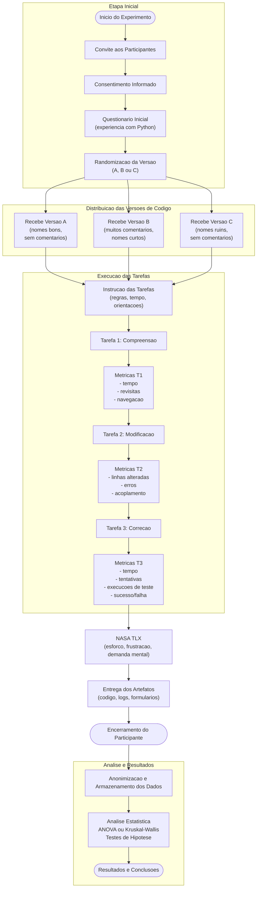

# 1. Identificação Básica

## 1.1 Título do Experimento
**Impacto da Estrutura do Código na Compreensão, Modificação e Correção em Manutenção de Software.**

## 1.2 ID / Código do Estudo
**EXP-MANUT-3VAR-2025**

## 1.3 Versão do Documento e Histórico de Revisão
| Versão | Data | Alterações |
|--------|-------|-------------|
| v1.0 | 2025-11-23 | Primeira versão do plano |
| v2.0 | 2025-11-28 |  Incrementação do plano  |
| v3.0 | 2025-12-01 | Fluxograma e tabelas |
| v4.0 | 2025-12-01 | Video e finalização |

## 1.4 Datas
- **Criação:** 23/11/2025  
- **Última atualização:** 12/12/2025  

## 1.5 Autores
- **Renato Cazzoletti**  

## 1.6 Responsável Principal (PI)
**Renato Cazzoletti**

## 1.7 Projeto / Produto / Iniciativa Relacionada
Este experimento compõe o **TCC de Engenharia de Software**, investigando fatores estruturais de código e sua influência na eficácia e eficiência de atividades de manutenção.

---

# 2. Contexto e Problema

## 2.1 Descrição do Problema / Oportunidade
A manutenção de software representa entre **40% e 70% do custo total do ciclo de vida**.  
Entretanto, práticas e padrões estruturais adotados pelas equipes variam bastante, impactando:

- tempo para compreender código  
- esforço cognitivo  
- taxa de erros  
- produtividade  
- qualidade do produto  

Há uma lacuna na compreensão de como **diferentes estruturas de código** influenciam tarefas reais de manutenção.

## 2.2 Contexto Organizacional e Técnico
O experimento ocorrerá em ambiente acadêmico controlado, com:

- estudantes com experiência básica em programação  
- máquinas com ambiente padronizado  
- código em **Python**  
- IDE recomendada (VS Code / PyCharm)  
- suíte de testes automatizada  
- scripts de logging  
- três versões de código equivalentes funcionalmente, mas estruturadas de forma diferente

## 2.3 Trabalhos e Evidências Prévias
Base teórica fundamentada em:

- Basili (manutenção e experimento empíricos)  
- Wohlin (métodos experimentais em engenharia de software)  
- Sommerville (engenharia de software e qualidade)  
- Estudos que analisam impacto de legibilidade e modularidade na manutenção  
- Pesquisas envolvendo refatoração e compreensibilidade  

## 2.4 Referencial Teórico e Empírico Essencial
Principais conceitos:

- Teoria da Carga Cognitiva (Sweller)  
- Engenharia de Manutenibilidade  
- Princípios de design (SRP, modularidade, clareza, coesão)  
- Código como artefato cognitivo  
- Relação entre estrutura de código e desempenho humano  

Esses conceitos sustentam as hipóteses de que estruturas mais claras reduzem esforço, tempo e erros.

---

# 3. Objetivos e Questões (GQM)

## 3.1 Objetivo Geral
Avaliar, **para desenvolvedores em nível iniciante a intermediário**, o efeito de diferentes estruturas de código (versões A, B e C) na **compreensão, modificação e correção** durante atividades de manutenção.

## 3.2 Objetivos Específicos
- **O1:** Investigar o impacto da estrutura do código na compreensão.  
- **O2:** Avaliar diferença de esforço e tempo em tarefas de modificação.  
- **O3:** Medir qualidade e corretude das implementações.  
- **O4:** Verificar impacto na correção de bugs.  
- **O5:** Avaliar carga cognitiva percebida.  

## 3.3 Questões de Pesquisa
- **Q1:** A estrutura do código influencia o tempo de compreensão?  
- **Q2:** Qual versão gera menor carga cognitiva?  
- **Q3:** Há diferença na qualidade das modificações?  
- **Q4:** A versão estrutural impacta a taxa de erros?  

## 3.4 Métricas Associadas
Exemplos (lista completa estará na Parte 4):

- **M1:** Tempo total (s)  
- **M2:** Número de arquivos visitados  
- **M3:** Precision/Recall da compreensão  
- **M9:** Complexidade ciclomática  
- **M11:** NASA-TLX  
- **M18:** Erros de compilação / execução

##  3.5 Tabela GQM

| Objetivo (O) | Perguntas (Q) | Métricas Associadas (M) |
|--------------|---------------|--------------------------|
| **O1 – Avaliar a compreensão do código nas versões A, B e C** | Q1.1 – A estrutura do código altera o tempo de compreensão? | M1 (Tempo de compreensão), M2 (Arquivos visitados) |
| | Q1.2 – A estrutura impacta a precisão da compreensão? | M3 (Score de compreensão), M4 (Número de revisitas ao código) |
| | Q1.3 – Participantes apresentam diferentes padrões de navegação conforme a versão? | M5 (Eventos de navegação), M2 (Arquivos visitados) |
| **O2 – Avaliar a eficiência em tarefas de modificação** | Q2.1 – A versão do código influencia o tempo de implementação? | M6 (Tempo de modificação), M7 (Execuções de testes) |
| | Q2.2 – A qualidade das modificações difere entre versões? | M9 (Complexidade ciclomática), M10 (Score Pylint) |
| | Q2.3 – A estrutura afeta a produtividade percebida? | M11 (NASA-TLX), M13 (Confiança subjetiva) |
| **O3 – Avaliar a qualidade do código produzido** | Q3.1 – As versões impactam a taxa de erros de compilação? | M18 (Erros IDE), M19 (Falhas de teste) |
| | Q3.2 – A versão influencia o número de iterações até passar nos testes? | M7 (Execuções de testes), M19 (Falhas de teste) |
| | Q3.3 – A versão impacta o acoplamento introduzido nas mudanças? | M21 (Acoplamento), M22 (Linhas modificadas) |
| **O4 – Avaliar esforço e carga cognitiva em todas as tarefas** | Q4.1 – Há diferença de carga cognitiva entre as versões? | M11 (NASA-TLX), M12 (Esforço percebido) |
| | Q4.2 – A estrutura impacta a frustração percebida? | M14 (Frustração), M13 (Confiança) |
| | Q4.3 – A versão do código influencia o tempo total da sessão? | M1 (Tempo total), M6 (Tempo modificação) |

## 3.6 Tabela de Métricas

| Código | Nome | Descrição | Unidade |
|--------|------|-----------|---------|
| M1 | Tempo de compreensão | Tempo total gasto na tarefa 1 | segundos |
| M2 | Arquivos visitados | Quantidade de arquivos abertos | contagem |
| M3 | Score de compreensão | Acertos no questionário de entendimento | pontos |
| M4 | Revisitas ao código | Número de retornos a trechos já lidos | contagem |
| M5 | Eventos de navegação | Cliques, scrolls, switches de arquivo | contagem |
| M6 | Tempo de modificação | Tempo total para implementar mudança | segundos |
| M7 | Execuções de teste | Quantidade de vezes que a suíte foi executada | contagem |
| M9 | Complexidade ciclomática | Medida estrutural calculada pelo Radon | número inteiro |
| M10 | Score Pylint | Avaliação estática de qualidade | escore (0–10) |
| M11 | NASA-TLX | Carga cognitiva global | escore (0–100) |
| M12 | Esforço percebido | Autorrelato do participante | escala Likert |
| M13 | Confiança | Avaliação subjetiva da solução | escala Likert |
| M14 | Frustração | Indicador subjetivo de desconforto | escala Likert |
| M18 | Erros de compilação | Quantidade de erros IDE | contagem |
| M19 | Falhas na suíte de testes | Número de testes falhando | contagem |
| M20 | Tentativas até sucesso | Iterações até todos os testes passarem | contagem |
| M21 | Acoplamento introduzido | Dependências novas criadas | contagem |
| M22 | Linhas modificadas | Linhas adicionadas/removidas | linhas |

---

# 4. Escopo e Contexto do Experimento

## 4.1 Escopo 

> **Analyze** três versões funcionalmente equivalentes de um mesmo código-fonte  
> **for the purpose of** avaliar e comparar  
> **with respect to their** compreensão, manutenibilidade, esforço cognitivo e qualidade da modificação  
> **from the point of view of the** pesquisador em Engenharia de Software  
> **in the context of** um experimento controlado com tarefas individuais de manutenção de software, realizadas por estudantes, utilizando a linguagem Python.

### Inclui
- Tarefas **individuais** de manutenção de software  
- Uso de **três versões distintas do mesmo código** (A, B e C)  
- Execução de tarefas de:
  - compreensão de código  
  - modificação de código  
  - correção de defeitos  
- Coleta de dados por meio de:
  - métricas objetivas (tempo, erros, acoplamento, complexidade, execuções de teste)  
  - métricas subjetivas (NASA-TLX, esforço percebido, frustração)

### Exclui
- Avaliação colaborativa ou em grupo  
- Análise longitudinal (efeitos de longo prazo)  
- Uso de linguagens de programação diferentes de Python  
- Avaliação em ambientes industriais ou com profissionais do mercado  

## 4.2 Contexto do Estudo
Caracteriza-se como:

- ambiente acadêmico  
- laboratório de ensino  
- participantes com 1–3 anos de experiência  
- tarefas controladas e padronizadas  

## 4.3 Premissas
- ambiente estará funcional  
- participantes seguirão o protocolo  
- código fornecerá respostas determinísticas  
- testes foram verificados previamente  

## 4.4 Restrições
- Tempo máximo por participante: 120 min  
- Amostra limitada à turma  
- Computadores unificados com mesma configuração  

## 4.5 Limitações Previstas
- Generalização restrita ao contexto educacional  
- Código pequeno comparado à indústria  
- Tarefas simplificadas 

## 4.6 Template de Definição de Escopo 

| Elemento | Descrição |
|----------|-----------|
| **Objeto de estudo** | Três versões de código Python (A, B, C) para realizar tarefas de manutenção. |
| **Propósito do estudo** | Avaliar o efeito da estrutura do código sobre compreensão, modificação, correção, esforço e erros. |
| **Perspectiva** | Pesquisador (visão de engenharia de software). |
| **Foco** | Eficiência, eficácia, esforço cognitivo e qualidade do código. |
| **Contexto** | Estudantes de Engenharia de Software em ambiente de laboratório. |
| **Tipo de experimento** | Controlado, entre-sujeitos, com três grupos independentes. |
| **Escopo incluído** | Tarefas de compreensão, modificação e correção; coleta objetiva e subjetiva; utilização das três versões. |
| **Escopo excluído** | Trabalho colaborativo; projetos reais; linguagens além de Python. |

---

# 5. Stakeholders e Impacto Esperado

## 5.1 Stakeholders
- Participantes  
- Orientador  
- Professores da banca  
- Comunidade de pesquisa  
- Estudantes futuros que poderão replicar estudo  

## 5.2 Interesses e Expectativas
| Stakeholder | Interesse |
|-------------|-----------|
| Participantes | Aprendizado, experiência prática |
| Orientador | Qualidade metodológica |
| Banca | Rigor científico |
| Comunidade | Replicabilidade |

## 5.3 Impactos Potenciais
- Pequeno aumento da carga de trabalho dos participantes  
- Dados úteis para decisões de design  
- Possibilidade de replicação em anos futuros  

# 6. Riscos de Alto Nível, Premissas e Critérios de Sucesso

## 6.1 Riscos de Alto Nível (Negócio, Técnicos e Humanos)

### **Riscos Técnicos**
- Falha em scripts de logging.
- IDE não registrar corretamente erros e warnings.
- Incompatibilidades entre versão da IDE e bibliotecas.
- Instabilidade na execução da suíte de testes.

### **Riscos Humanos**
- Participante desistir durante a tarefa.
- Fadiga ou frustração influenciar desempenho.
- Dificuldade de entendimento das instruções.

### **Riscos Organizacionais**
- Laboratório indisponível na data marcada.
- Interferência externa durante as sessões (ruídos, interrupções).
- Agenda conflitante dos participantes.

### **Riscos Científicos**
- Amostra insuficiente → baixo poder estatístico.
- Viés de seleção prejudicando comparabilidade.
- Violação das premissas dos testes estatísticos.

---

## 6.2 Critérios de Sucesso Globais (Go/No-Go)

O experimento será considerado **viável** se:

- Pelo menos **80% dos participantes completos** concluírem todas as tarefas.
- Todas as métricas essenciais forem registradas com consistência.
- Scripts de logging funcionarem em **100%** das sessões.
- Dados forem suficientes para comparar os três tratamentos.
- Não houver violação crítica de pressupostos estatísticos.

---

## 6.3 Critérios de Parada Antecipada (Pré-execução)

O experimento será **suspenso** caso:

- Scripts apresentem falhas replicáveis e não contornáveis.
- O laboratório de informática fique indisponível.
- A amostra efetiva fique inferior a 10 participantes.
- Problemas éticos sejam identificados durante o processo.
- Testes automatizados falharem sistematicamente sem explicação.

---

# 7. Modelo Conceitual e Hipóteses

## 7.1 Modelo Conceitual do Experimento

A lógica do modelo:

Em termos formais:

- A estrutura do código altera o **nível de compreensão**.  
- A compreensão afeta o **esforço cognitivo**.  
- O esforço influencia **tempo** e **produtividade**.  
- Todos juntos influenciam **qualidade do código produzido**.

---

## 7.2 Hipóteses Formais

### **Para Q1 — Tempo de Compreensão**
- **H0:** Não há diferença significativa no tempo entre versões A, B e C.  
- **H1:** Pelo menos uma versão apresenta tempo significativamente menor.

### **Para Q2 — Carga Cognitiva**
- **H0:** A carga cognitiva é a mesma para A, B e C.  
- **H1:** Existe diferença significativa entre as cargas cognitivas.

### **Para Q3 — Qualidade da Modificação**
- **H0:** A qualidade do código modificado é igual entre as versões.  
- **H1:** Alguma versão apresenta qualidade superior/menor.

### **Para Q4 — Taxa de Erros**
- **H0:** Não há diferença na taxa de erros cometidos.  
- **H1:** A estrutura influencia diretamente a taxa de erros.

---

## 7.3 Nível de Significância e Poder Estatístico

- **Nível de significância (α):** 0.05  
- **Poder estatístico desejado:** ≥ 0.80  
- **Tamanho de efeito esperado:** moderado (d = 0.5)

Devido ao tamanho da amostra, o poder estatístico será reavaliado após coleta.

---

# 8. Variáveis, Fatores, Tratamentos e Objetos

## 8.1 Objetos de Estudo

O experimento utiliza **três versões do mesmo código**, todas funcionalmente idênticas, diferindo apenas na clareza, nomeação e documentação. Essas diferenças estruturais são essenciais para avaliar impacto na compreensão, modificação, esforço cognitivo e taxa de erros.

### **Versão A — Sem comentários, nomes descritivos**
- Não possui comentários explicativos.
- Nomes de variáveis e funções são longos, claros e autoexplicativos.
- Facilita a compreensão mesmo sem documentação adicional.

---

### **Versão B — Muitos comentários, nomes curtos**
- Contém muitos comentários detalhados.
- Os nomes são curtos, genéricos e pouco informativos.
- A leitura exige alternância constante entre comentários e código.

---

### **Versão C — Sem comentários e com nomes ruins**
- Não possui comentários.
- Nomes são ruins, genéricos ou confusos.
- Representa a pior legibilidade e manutenibilidade.

---

### **Resumo Comparativo**
| Versão | Comentários | Nomes | Dificuldade Esperada |
|--------|-------------|--------|-----------------------|
| **A** | Nenhum | Descritivos e claros | Média |
| **B** | Muitos | Curtos e pouco informativos | Alta |
| **C** | Nenhum | Ruins / confusos | Muito alta |

Cada uma implementa exatamente o mesmo comportamento funcional.

---

## 8.2 Sujeitos / Participantes
Participantes serão estudantes da disciplina de Engenharia de Software:

- 1 a 4 anos de experiência programando  
- Familiaridade com Python: variável  
- Total estimado: entre 18 e 24 participantes  

---

## 8.3 Variáveis Independentes (Fatores)
- **Fator principal:** Tipo da versão do código.  
- **Níveis:** A, B, C.

---

## 8.4 Tratamentos (Condições Experimentais)
- **Grupo A** → recebe código da versão A  
- **Grupo B** → recebe código da versão B  
- **Grupo C** → recebe código da versão C  

A alocação será randomizada.

---

## 8.5 Variáveis Dependentes (Respostas)
(Resumo — a lista completa aparece novamente na Parte 4)

- Tempo total (s)  
- Erros cometidos  
- Pontuação de compreensão  
- Qualidade do código modificado  
- Carga cognitiva subjetiva (NASA-TLX)  
- Número de execuções dos testes  

---

## 8.6 Variáveis de Controle
- Ambiente idêntico  
- Versão da IDE  
- Tarefas idênticas  
- Tempo máximo por sessão  
- Testes automatizados iguais  

---

## 8.7 Variáveis de Confusão Conhecidas
- Experiência prévia com Python  
- Fadiga  
- Motivação  
- Estratégias pessoais de navegação  
- Familiaridade com IDE  
- Histórico de estudo/trabalho recente com manutenção

Essas variáveis serão registradas via questionário inicial.

## 8.8 Tabela de Variáveis do Experimento

| Tipo | Nome | Descrição |
|------|------|-----------|
| Independente | Versão do Código | Níveis A, B e C |
| Dependente | Tempo de compreensão | M1 |
| Dependente | Score de compreensão | M3 |
| Dependente | Tempo de modificação | M6 |
| Dependente | Qualidade estrutural | M9, M10 |
| Dependente | Carga cognitiva | M11 |
| Dependente | Taxa de erros | M18, M19 |
| Controle | Ambiente | Mesmo hardware, IDE, versão Python |
| Controle | Tarefas | Iguais para todos participantes |
| Controle | Tempo máximo | 120 minutos |
| Confusão | Experiência em Python | Variável demográfica |
| Confusão | Familiaridade com IDE | Variável demográfica |
| Confusão | Fadiga | Variável subjetiva |

## 8.9 Fatores e Tratamentos

| Fator | Níveis (Tratamentos) | Descrição |
|--------|------------------------|-------------|
| Estrutura do Código | A, B, C | Versões diferentes do mesmo sistema |

### Combinações Possíveis

| Combinação | Descrição |
|------------|-----------|
| A → Tarefas 1–3 | Participante executa tarefas usando código A |
| B → Tarefas 1–3 | Participante executa tarefas usando código B |
| C → Tarefas 1–3 | Participante executa tarefas usando código C |

---

# 9. Desenho Experimental

## 9.1 Tipo de Desenho
**Desenho entre sujeitos (between-subjects), completamente randomizado.**

Justificativa:  
Evita efeito de aprendizagem entre versões, reduz tempo por participante, simplifica protocolo.

---

## 9.2 Randomização e Alocação
Processo:

1. Após preencher dados demográficos, cada participante recebe um ID.  
2. O ID alimenta um script que sorteia um grupo.  
3. O participante é encaminhado à estação correspondente (A/B/C).  

A randomização garante balanceamento e imparcialidade.

---

## 9.3 Balanceamento e Contrabalanço
- Tamanho de cada grupo será equilibrado (aprox. 6–8 participantes).  
- A ordem das tarefas é fixa (compreensão → modificação → bug fix).  
- Como é entre sujeitos, contrabalanço de condições não se aplica.  

---

## 9.4 Número de Grupos e Sessões
- **3 grupos** (A, B, C).  
- **1 sessão por participante**, duração ~120 min.  
- Cada sessão engloba todas as tarefas.

---

# 10. População, Sujeitos e Amostragem

## 10.1 População-Alvo
Desenvolvedores juniores ou estudantes com experiência intermediária, perfil típico de profissionais no início de carreira.

---

## 10.2 Critérios de Inclusão
- Ter familiaridade com lógica e programação.  
- Conhecimento básico de Python.  
- Aceitar participar voluntariamente.

---

## 10.3 Critérios de Exclusão
- Falta total de experiência em programação.  
- Impedimentos éticos (parentesco com o pesquisador, por exemplo).  
- Participar do piloto.  
- Indisponibilidade no dia da coleta.

---

## 10.4 Tamanho da Amostra Planejado
- **Total:** 18 a 24 participantes.  
- **Por grupo:** 6 a 8 participantes.  

Essa distribuição permite comparação estatística significativa dentro das limitações acadêmicas.

---

## 10.5 Método de Seleção / Recrutamento
- Amostragem por conveniência: turma da disciplina.  
- Divulgação via professor, e-mail e Moodle.  
- Participação não obrigatória.

---

## 10.6 Treinamento e Preparação
- Mini tutorial (5 a 10 minutos).  
- Mostra como executar testes.  
- Garante entendimento do protocolo.  
- Evita vieses de habilidade com ferramentas.

# 11. Instrumentação e Protocolo Operacional

Esta seção detalha **todos os instrumentos, materiais, processos e rotinas** utilizados na execução do experimento, garantindo reprodutibilidade, padronização e rastreabilidade.

---

## 11.1 Instrumentos de Coleta

### **A) Instrumentos Automáticos**
| Instrumento | Função | Dados Coletados | Métricas |
|-------------|--------|------------------|----------|
| **Script de Logging (Python)** | Captura ações em tempo real | timestamps, arquivos abertos, execuções | M1, M4, M6, M7 |
| **Logs da IDE** | Erros em tempo real | syntax errors, warnings | M18 |
| **Radon** | Análise de complexidade | complexidade ciclomática | M9 |
| **Pylint / Flake8** | Qualidade estrutural | score de legibilidade | M10 |
| **Test Runner** | Execução da suíte | falhas e sucessos | M19, M20 |

### **B) Instrumentos Manuais**
| Instrumento | Função | Métricas |
|-------------|---------|-----------|
| Questionário Inicial | Dados demográficos | variáveis de confusão |
| NASA-TLX | Carga cognitiva | M11, M12 |
| Escala Likert | Satisfação, confiança | M13 |
| Ficha de Observação | Registro comportamental | apoio qualitativo |

### **C) Instrumentos Híbridos**
- Google Forms (exportação CSV)  
- Excel (consolidação)  
- Repositório Git com versionamento das soluções  

---

## 11.2 Materiais de Suporte

### **Para participantes**
- Guia do participante  
- Tutorial de ambiente  
- Manual de execução de testes  
- FAQ de dúvidas comuns  
- Instruções impressas de cada tarefa  

### **Para pesquisadores**
- Checklist pré-sessão  
- Template de anotações  
- Scripts de validação  
- Relatórios automáticos pós-sessão  

---

## 11.3 Procedimento Experimental (Passo a Passo)

### **FASE 1 — Recepção e Preparação**
1. Recepção do participante.  
2. Explicação do estudo.  
3. Coleta de consentimento.  
4. Preenchimento do questionário demográfico.  
5. Treinamento rápido (tutorial).  
6. Inicialização dos scripts de logging.

---

### **FASE 2 — Tarefa 1: Compreensão**
1. Participante lê a descrição do problema.  
2. Abre a versão do código (A/B/C).  
3. Realiza inspeção e navegação livre.  
4. Ao finalizar, preenche questionário de compreensão.

**Coleta:** M1, M2, M3, M4, M5

---

### **FASE 3 — Tarefa 2: Modificação**
1. Ler requisito de mudança.  
2. Implementar a nova funcionalidade.  
3. Rodar testes até passar.  
4. Submeter arquivo final.

**Coleta:** M6–M10, M18

---

### **FASE 4 — Tarefa 3: Correção de Bug**
1. Descrição do bug é entregue.  
2. Localizar origem do problema.  
3. Corrigir e validar com testes.  
4. Submeter solução final.

**Coleta:** M16–M20

---

### **FASE 5 — Finalização**
1. Preenchimento do NASA-TLX.  
2. Questionário subjetivo.  
3. Encerramento e agradecimento.  
4. Backup automático dos dados.

---

## 11.4 Fluxograma operacional do experimento

---

# 12. Plano de Análise de Dados

## 12.1 Estratégia Geral
1. **Validação:** verificar ausência de falhas nos dados.  
2. **Descritiva:** média, mediana, variância, IQR.  
3. **Normalidade:** Shapiro-Wilk.  
4. **Comparação:** ANOVA ou Kruskal-Wallis.  
5. **Correlações:** Pearson ou Spearman.  
6. **Efeito:** Cohen’s d, η².  
7. **Qualitativo:** codificação, categorias, triangulação.  

---

## 12.2 Métodos Estatísticos Planejados

| Tipo de Métrica | Normal? | Teste | Medidas Complementares |
|------------------|---------|--------|-------------------------|
| Tempo | Sim | ANOVA | Tukey |
| Tempo | Não | Kruskal-Wallis | Dunn |
| Carga Cognitiva | Não | Mann-Whitney | ρ |
| Qualidade | Sim | ANOVA | d |
| Erros | – | Qui-quadrado | distribuição Poisson |

---

## 12.3 Tratamento de Dados Faltantes
- Até 5% → imputação por média/mediana  
- 5–20% → imputação múltipla  
- +20% → exclusão da métrica  
- Falha total → marcação como “não realizado”  

---

## 12.4 Análise Qualitativa
Método adotado: **Análise de Conteúdo (Bardin)**.

Etapas:  
1. Pré-análise  
2. Codificação  
3. Agrupamento  
4. Interpretação e triangulação  

Categorias previstas:
- frustração  
- clareza percebida  
- navegabilidade  
- confiança na solução  

---

# 13. Avaliação de Validade

Esta seção discute as principais ameaças à validade do experimento, considerando
explicitamente o desenho adotado, o uso de três versões de código (A, B e C),
as tarefas de manutenção (compreensão, modificação e correção) e as métricas
objetivas e subjetivas coletadas.

---

## 13.1 Validade de Conclusão

### Ameaças
- **Baixo poder estatístico:**  
  O experimento depende de uma amostra limitada de participantes (estudantes),
  o que pode reduzir a capacidade de detectar diferenças estatisticamente
  significativas entre as versões A, B e C, especialmente em métricas com alta
  variabilidade, como tempo de execução e esforço percebido.
  
- **Variabilidade de habilidade entre participantes:**  
  Diferenças individuais de experiência prévia com Python e manutenção de
  software podem influenciar os resultados, mascarando ou amplificando efeitos
  atribuídos à estrutura do código.

- **Erros instrumentais:**  
  Falhas na coleta automática de métricas (logs incompletos, falhas de registro
  de tempo ou execuções de teste) podem comprometer a confiabilidade dos dados
  quantitativos.

### Mitigações
- Definição de uma **amostra mínima de 18 participantes**, com balanceamento
  entre as versões A, B e C.
- Uso de **instrumentação redundante**, combinando logs automáticos,
  registros de execução e questionários.
- Aplicação de **ANOVA ou Kruskal-Wallis**, conforme a distribuição dos dados,
  e uso de **análise de covariância** caso diferenças de experiência se mostrem
  estatisticamente relevantes.

---

## 13.2 Validade Interna

### Ameaças
- **Fadiga:**  
  Como cada participante executa três tarefas consecutivas (compreensão,
  modificação e correção), existe o risco de queda de desempenho nas etapas finais,
  afetando métricas como tempo e número de erros.

- **Diferença prévia entre grupos:**  
  Mesmo com randomização, grupos atribuídos às versões A, B ou C podem apresentar
  diferenças iniciais de conhecimento ou familiaridade com o domínio do código.

- **Ambiente ruidoso:**  
  Interrupções, variações de hardware ou condições externas podem interferir no
  desempenho durante a execução das tarefas.

### Mitigações
- Planejamento de **sessões com duração limitada**, evitando sobrecarga
  prolongada.
- **Randomização completa** da alocação dos participantes às versões A, B e C.
- Execução do experimento em **ambiente controlado**, com instruções padronizadas
  e condições equivalentes para todos os participantes.

---

## 13.3 Validade de Constructo

### Ameaças
- **Métricas não representarem adequadamente os construtos avaliados:**  
  Métricas como tempo, número de erros ou execuções de teste podem não capturar
  completamente conceitos como compreensão ou manutenibilidade.

- **Interpretação ambígua de perguntas subjetivas:**  
  Questões relacionadas a esforço, frustração ou dificuldade podem ser
  interpretadas de forma diferente pelos participantes.

### Mitigações
- Uso do **NASA-TLX**, um instrumento validado na literatura para medir carga
  cognitiva e esforço percebido.
- Realização de **questionários pilotados**, permitindo ajustes de linguagem e
  clareza antes da execução definitiva do experimento.
- Combinação de **métricas objetivas e subjetivas**, reduzindo dependência de um
  único tipo de medida.

---

## 13.4 Validade Externa

### Ameaças
- **Código simples em comparação a sistemas industriais:**  
  O código utilizado no experimento é menor e menos complexo do que sistemas
  reais, o que pode limitar a generalização dos resultados.

- **Amostra acadêmica:**  
  A utilização de estudantes como participantes pode não refletir o comportamento
  de desenvolvedores profissionais em ambientes industriais.

### Mitigações
- Descrição clara dessas limitações no relatório final, evitando generalizações
  indevidas.
- **Sugestão explícita de replicações futuras** com profissionais e sistemas de
  maior porte.

---

## 13.5 Tabela Resumo das Ameaças

| Tipo        | Ameaça                                 | Risco | Mitigação Principal                          |
|-------------|----------------------------------------|-------|----------------------------------------------|
| Conclusão   | Baixo poder estatístico                | Médio | Amostra mínima e testes adequados            |
| Conclusão   | Variabilidade de habilidade            | Médio | Randomização e covariância                   |
| Interna     | Fadiga                                 | Alto  | Sessões curtas e controle de tempo           |
| Interna     | Diferença prévia entre grupos          | Médio | Randomização completa                        |
| Constructo  | Métricas não representativas           | Médio | NASA-TLX e métricas combinadas               |
| Externa     | Código pequeno e amostra acadêmica     | Alto  | Transparência e replicações futuras          |

# 14. Ética, Privacidade e Conformidade

## 14.1 Questões Éticas
- Participação voluntária  
- Risco mínimo  
- Pode desistir a qualquer momento  
- Tarefas não afetam nota da disciplina  

---

## 14.2 Consentimento Informado
Documento contendo:
- Objetivos  
- Procedimentos  
- Riscos/Benefícios  
- Sigilo dos dados  
- Contatos do pesquisador  

---

## 14.3 Privacidade e LGPD
- Dados anonimizados  
- Identificação substituída por ID  
- Armazenamento criptografado  
- Retenção por até 5 anos  

---

## 14.4 Aprovações Necessárias
- Comitê de Ética da instituição  
- Orientador  
- Coordenação de curso  

---

# 15. Recursos, Infraestrutura e Orçamento

## 15.1 Recursos Humanos
| Papel | Responsabilidade |
|-------|-------------------|
| PI | Coordenação geral |
| Orientador | Validação científica |
| Auxiliar | Apoio às sessões |
| Participantes | Execução das tarefas |

---

## 15.2 Infraestrutura Técnica
- 10–20 computadores idênticos  
- IDE (VS Code ou PyCharm)  
- Python 3.12  
- Test Runner configurado  
- Repositório Git privado  

---

## 15.3 Materiais e Insumos
- Termos impressos  
- Instruções das tarefas  
- Coffee break  
- Extensões e cabos de energia  
- Pendrive para backup emergencial  

---

## 15.4 Orçamento Estimado

| Item | Custo (R$) |
|------|-------------|
| Impressões | 30 |
| Coffee Break | 100 |
| Pendrive | 60 |
| Outros (imprevistos) | 50 |
| **Total** | **240** |

# 16. Cronograma, Marcos e Riscos Operacionais

## 16.1 Macrocronograma (Pré-execução até Execução)

| Semana | Atividade | Entregáveis |
|--------|------------|-------------|
| 1 | Ajustes finais do plano | Versão v2.0 |
| 2 | Submissão ao Comitê de Ética | Protocolo |
| 3 | Correções solicitadas | v2.1 |
| 4 | Execução do piloto | Relatório do piloto |
| 5 | Ajustes pós-piloto | v2.2 |
| 6–9 | Execução das sessões experimentais | Dados coletados |
| 10 | Análise inicial dos dados | Base consolidada |
| 11 | Análise estatística completa | Relatório preliminar |
| 12 | Discussão e resultados | Documento final |
| 13 | Escrita final do TCC | Capítulo de métodos |
| 14 | Entrega | Versão final |

---

## 16.2 Dependências Entre Atividades

- Coleta **só inicia** após aprovação do Comitê de Ética.  
- Ajustes no código dependem do piloto.  
- Consolidação dos dados depende do fim das sessões.  
- Análise estatística depende do conjunto final de métricas.  

---

## 16.3 Riscos Operacionais e Contingências

| Risco | Impacto | Probabilidade | Contingência |
|-------|----------|----------------|---------------|
| Falha no laboratório | Alto | Baixa | Sessões remotas |
| Ausência de participantes | Médio | Média | Overbooking |
| Erro nos logs | Alto | Baixa | Coleta manual secundária |
| Testes quebrados | Alto | Muito Baixa | Reversão para snapshot estável |

---

# 17. Governança do Experimento

## 17.1 Papéis e Responsabilidades Formais

| Papel | Responsabilidades |
|-------|-------------------|
| **Pesquisador Principal (PI)** | Coordenação total, execução, análise estatística |
| **Orientador** | Supervisão científica, revisão metodológica |
| **Auxiliar Técnico** | Apoio nas sessões e controle do ambiente |
| **Participantes** | Execução das tarefas experimentais |

---

## 17.2 Ritos de Acompanhamento Pré-Execução
- **Reunião semanal** PI + orientador  
- **Checklist diário** antes das sessões  
- **Briefing pré-sessão** com auxiliar  
- **Debriefing pós-sessão** com registro de problemas  

---

## 17.3 Processo de Controle de Mudanças
1. Solicitação formal registrada.  
2. Avaliação pelo PI.  
3. Revisão científica pelo orientador.  
4. Aprovação conjunta.  
5. Registro no histórico de versões.  

---

# 18. Plano de Documentação e Reprodutibilidade

## 18.1 Repositórios e Convenções de Nomeação
- Repositório GitHub privado:  
  - `/code-A`  
  - `/code-B`  
  - `/code-C`  
  - `/scripts`  
  - `/data-raw`  
  - `/data-clean`  
  - `/analysis`  

Nomes dos arquivos seguem padrão:  
`[ID-Participante]_[Tarefa]_[Versao].py`

---

## 18.2 Templates e Artefatos Padrão
- Template do NASA-TLX  
- Template de questionário inicial  
- Template de anotação de sessão  
- Scripts padronizados de logging  
- Planilhas mestre de métricas  

---

## 18.3 Empacotamento para Replicação
Inclui:  
- Código congelado  
- Scripts  
- Guia de execução  
- Questionários  
- Dados anonimizados  
- Versão final do protocolo  

Objetivo: permitir que outra equipe replique o estudo sem suporte adicional.

---

# 19. Plano de Comunicação

## 19.1 Públicos e Mensagens-Chave

| Público | Mensagem |
|---------|-----------|
| Participantes | Datas, duração, instruções |
| Orientador | Progresso, riscos e ajustes |
| Comitê de Ética | Alterações relevantes |
| Coordenação | Agendamento de laboratório |

---

## 19.2 Canais e Frequência de Comunicação
- E-mail institucional  
- WhatsApp (grupo de participantes)  
- GitHub (parte técnica)  
- Google Drive (documentos)  

---

## 19.3 Pontos Obrigatórios de Comunicação
- Aprovação do protocolo  
- Início e fim das coletas  
- Problemas técnicos graves  
- Mudanças de cronograma  
- Entrega do relatório final  

---

# 20. Critérios de Prontidão (Definition of Ready)

## 20.1 Checklist Completo
- [x] Aprovação do Comitê de Ética  
- [x] Versões A/B/C revisadas  
- [x] Scripts testados  
- [x] Sala/laboratório reservado  
- [x] Questionários ativos  
- [x] Material impresso  
- [x] Ambiente de testes verificado  
- [x] Guia do participante atualizado  
- [x] Backup configurado  
- [x] Piloto executado e validado  

---

## 20.2 Aprovações Finais Necessárias
A execução começa somente após aprovação formal de:

- **Orientador**  
- **Comitê de Ética**  
- **Pesquisador Principal (PI)**  

Confirmação registrada por e-mail ou assinatura digital.

---

